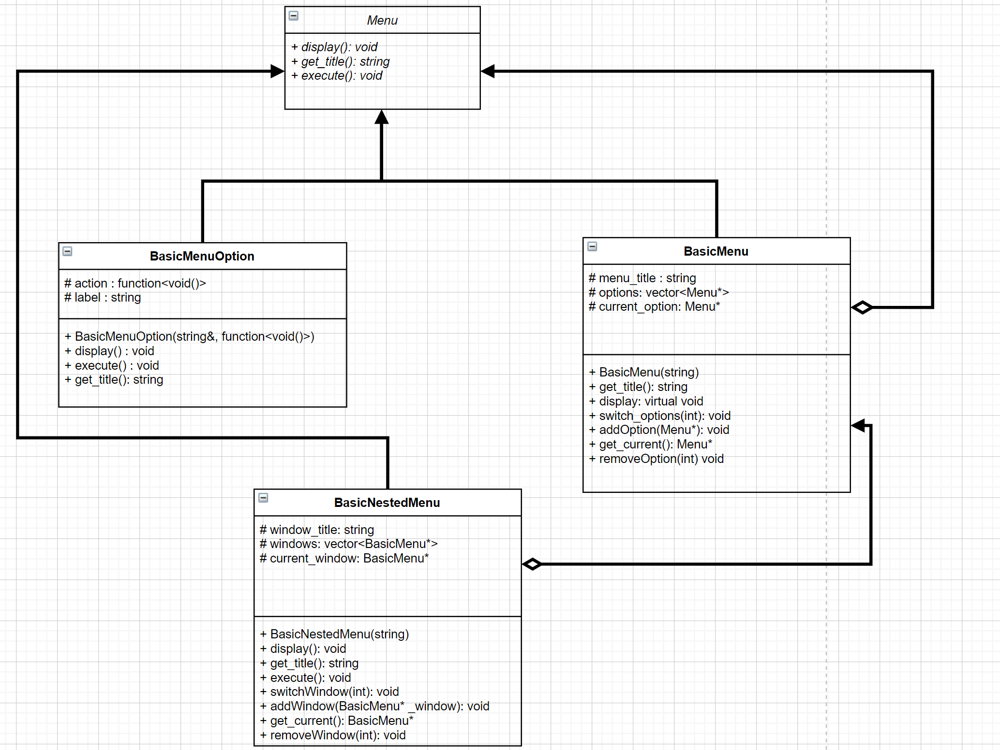
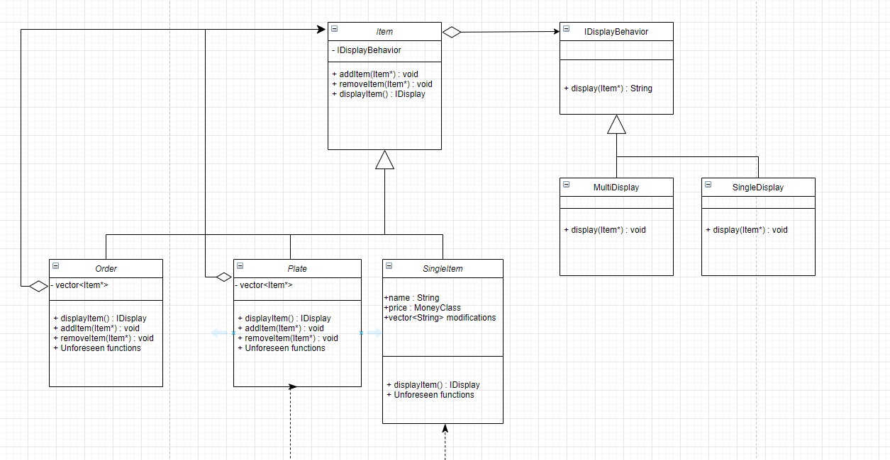
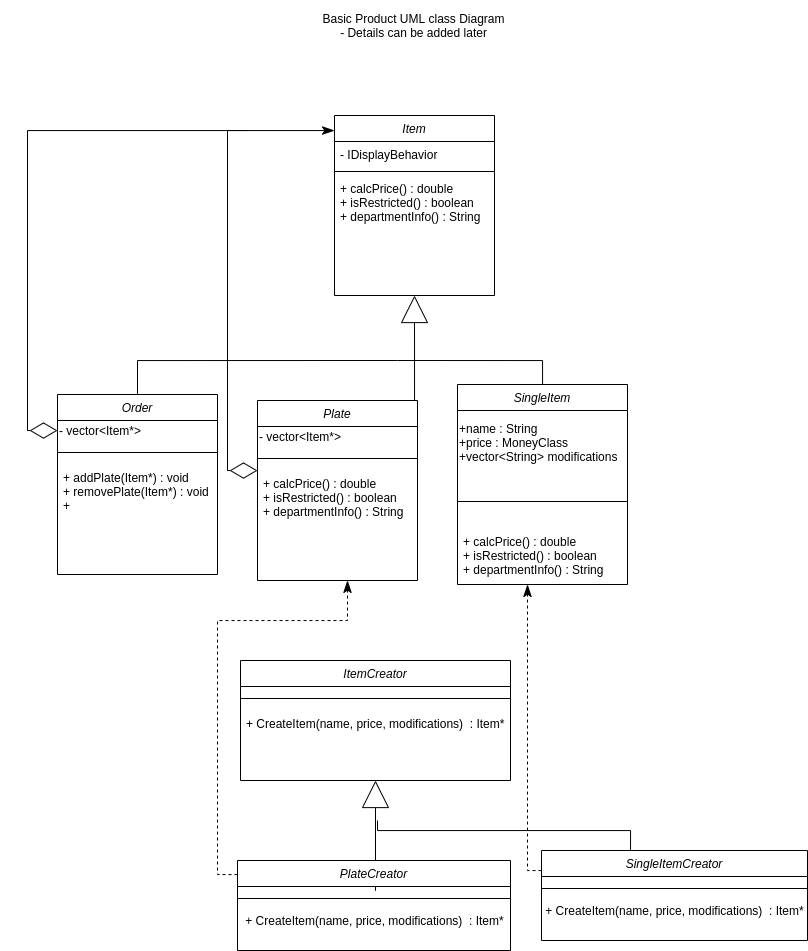

 
 # Title:  Cash Register Application
 ### Authors: [Ethan Bayer](https://github.com/EthanBayer), [Bryan Guevara](https://github.com/Guevara-Bryan), [Shruti Jawale](https://github.com/shjawale)

 ## Description:
 * As a group we have decided to create a cash register application as we are all College students and with that title comes a great deal of debt and so many college students get part time jobs to help with the rising costs. While, one part time job we are all familiar with is being a cashier and so we thought it might be interesting to design our own software in simulating a cash register and see how it holds up to company certified cash register software. 
 
 * In terms of tools we will be using, we are going to be using C++ as our primary language and using PUTTY, or in general a command line console, to implement our text based cash register program, however if time allows we will also see if we can create a GUI for our software.
  
* We forsee the overall input of our software being the Items a Customer is purchasing and the Payment they will use to purchase their Items, while in terms of output we will need to display the Item being scanned and the cost to the Customer, along with the sales and other possible information gathered by the cash register in a day of work. However, these may be subject to change or addition as we move further with this project.
  
## Design Patterns:

  * One Design Pattern we will be using is the Strategy Behavorial Pattern as it allows a family of Algorithms to become interchangeable. This will be utilized in our implementation of Products within a store as each Item has similarities as well as differences between each other such as departments so we want the client using it to be able to apply/scan multiple Items to the cash register that all have different behaviour in some way. In that way, we will be creating multiple behaviors or Strategies for products that will all have their own concrete strategies which will allow a product to become a unique Item depending on its behaviors. This can be illustrated if we want an item to have a weighted price behavior instead of a regular price so we would give it the weighted concrete strategy from the price behavior strategy. With that modularity that a Strategy pattern proivdes we will be able to create products for both Stores and restaurants or really any service that requires a monetary customer interaction.
  
  * Another Design Pattern we will be using is the Abstract Factory pattern as it provides an interface creating large groups of similar objects. We want to use that pattern as it will allow our cash registar to be able to handle a myraid of products that may all have different features or requirements for purchase such as Alcohol. This will also allow us to have a large variety of products that are semi independent from each other, so if we need to change one product, the rest are not affected.
  
  * The last design pattern we will be using is the Composite pattern. Our program will require several menus to be displayed to the user, and we want each menu to be treated very much the same. By using the composite pattern it will allow us to create menus, and menus withing the menus while still having one interface shared between them. This will make designing and adding to the menus much more flexible and convenient as well as scalable if we desided to expand the options of our program.

 > ## Phase II
 # Class Diagrams
## Menu Class Diagram

For this class we have decided to use the composite pattern. The `Menu` class is, in this case, is the `Component`, the `BasicMenuOption` is a `Leaf` and the `BasicNestedMenu` is a `Composite`. For our project we will not be using a GUI, but rather a text-based interface, However adding a graphic interface is also possible with this class. For the menu class, one of our goals was to make it very modular, since we may be working each window of the menu separately, so this class allows for each of us to be able to separately work on different menus and later add them as either new submenus or menus of their own.

## Item Class

In designing an Item for our Cash Register, we will be using the `Item` class as both a Component for a composite pattern and as the Context for the Strategy Pattern. The `IDisplayBehavior` class shall act as our main Strategy for our Items to create concrete strategy behaviors for displaying Items that are singular (`SingleDisplay`) such as a drink or a specific meat type, or a concrete strategy for Items containing multiple Items (`MultiDisplay`) such as for plates and orders. Then we have the three children classes of Item starting with class `SingleItem` which is a leaf for the Item Component that represents single parts of a plate of food such as the meat and/or rice for the main plate. The `SingleItem` class will also have an additional Money class which will handle money interactions and a vector of Strings which will have modifications such as "No ice" or something to that degree. Then we have the `Plate` class which is a composite of the Item Component that represents a plate of food being represented by multiple food items. Finally, we have the `Order` class which is a composite of the Item component that represents the overall order that can be composed of not only Plates of food but also of single Items. 

## Item Creator Diagram

In this project we are using the Factory Method Pattern  to create necessary Products, in this case `Item`. The Concrete Products are `Order`, `Plate`, and `SingleItem`. `PlateCreator` will return a `Plate` and `SingleItemCreator` will return a `Single Item`. Both of these concrete creators are subclasses of `ItemCreator`. Within the Factory Method Pattern, we are implementing parameterized factory method. This means that `PlateCreator` will be responsible for all the different types of plates, differentiating between them using the attributes passed into the constructor. Same goes for the `SingleItemCreator`. 
 
 > ## Phase III
 > You will need to schedule a check-in with the TA (during lab hours or office hours). Your entire team must be present. 
 > * Before the meeting you should perform a sprint plan like you did in Phase II
 > * In the meeting with your TA you will discuss: 
 >   - How effective your last sprint was (each member should talk about what they did)
 >   - Any tasks that did not get completed last sprint, and how you took them into consideration for this sprint
 >   - Any bugs you've identified and created issues for during the sprint. Do you plan on fixing them in the next sprint or are they lower priority?
 >   - What tasks you are planning for this next sprint.

 > ## Final deliverable
 > All group members will give a demo to the TA during lab time. The TA will check the demo and the project GitHub repository and ask a few questions to all the team members. 
 > Before the demo, you should do the following:
 > * Complete the sections below (i.e. Screenshots, Installation/Usage, Testing)
 > * Plan one more sprint (that you will not necessarily complete before the end of the quarter). Your In-progress and In-testing columns should be empty (you are not doing more work currently) but your TODO column should have a full sprint plan in it as you have done before. This should include any known bugs (there should be some) or new features you would like to add. These should appear as issues/cards on your Kanban board. 
 ## Screenshots
 > Screenshots of the input/output after running your application
 ## Installation/Usage
 > Instructions on installing and running your application
 ## Testing
 > How was your project tested/validated? If you used CI, you should have a "build passing" badge in this README.
The googletests format was the basis of how we tested our functions and classes. We tested our menu and display classes by checking the output of each of the print functions. The creator class was tested by creating an object and checking if the member variables matched the ones inputted as arguments to the member function. The remaining class tests were done in a similar way to the creator class test.
